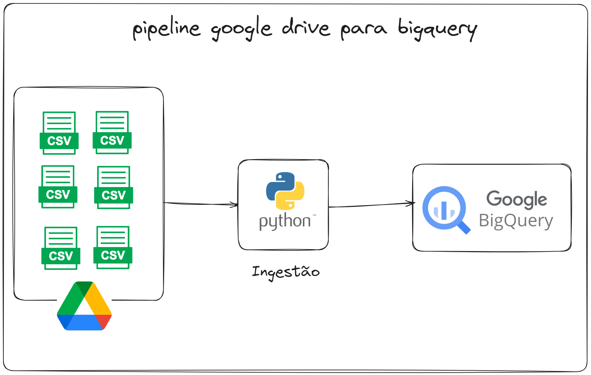

# Leitura de Arquivos no Google Drive e Ingestão no BigQuery

Este projeto realiza a **leitura de arquivos do Google Drive** e a **ingestão desses dados no BigQuery**. A solução é capaz de lidar com arquivos nos formatos CSV, XLSX e XLS, concatenando múltiplos arquivos em um único DataFrame antes de carregá-los em uma tabela no BigQuery.

## Pré-requisitos

1. **Conta do Google Cloud Platform (GCP)**: Certifique-se de ter uma conta no Google Cloud e um projeto configurado no BigQuery.

2. **Google Drive API**: A API Google Drive deve estar ativada no seu projeto Google Cloud.

## Passo a Passo

### 1. Clone este Repositório

Clone o repositório para o seu ambiente local utilizando o comando:

git clone: `git@github.com:lucasphn/files_google_drive_for_bigquery.git`

### 2\. Crie e Ative um Ambiente Virtual

Crie um ambiente virtual para isolar as dependências do projeto:

`python -m venv .venv`

Ative o ambiente virtual:

-   **Windows (PowerShell)**:

    `.venv\Scripts\Activate.ps1`

-   **Windows (Command Prompt)**:

    `.venv\Scripts\activate.bat`

-   **Linux/MacOS**:

    `source .venv/bin/activate`

### 3\. Instale as Dependências

Instale as bibliotecas necessárias a partir do arquivo `requirements.txt`:

`pip install -r requirements.txt`

### 4\. Ative a API Google Drive

No Console do Google Cloud:

1.  Navegue até o Console de APIs do Google.
2.  Selecione seu projeto.
3.  Vá para **"Biblioteca"** e busque por **"Google Drive API"**.
4.  Ative a API para o seu projeto.

### 5\. Crie e Configure a Conta de Serviço

1.  Navegue até o Console do Google Cloud.
2.  Vá para **"IAM e Admin"** > **"Contas de Serviço"**.
3.  Crie uma nova conta de serviço com permissões adequadas para o BigQuery e Google Drive.
4.  Gere uma chave de conta de serviço no formato JSON e faça o download.
5.  Cole o arquivo JSON na raiz do seu repositório e renomeie para `keyfile.json`.

### 6\. Compartilhe a Pasta no Google Drive

1.  No Google Drive, compartilhe a pasta que você deseja ler com o e-mail da conta de serviço (exemplo: `adm-dw@dw-with-modern-data-stacks.iam.gserviceaccount.com`).

### 7\. Obtenha o ID da Pasta

1.  No Google Drive, abra a pasta que você deseja ler.
2.  Copie o ID da pasta da URL (é a parte após `folders/`).

### 8\. Configure o Código

No seu código, substitua a variável `folder_id` pelo ID da pasta que você copiou.

### 9\. Execute o Código

Execute o script Python para iniciar o processo de leitura e ingestão dos dados:

`python nome_do_script.py`

Detalhes Adicionais
-------------------

-   **Requisitos do Sistema**: 
Certifique-se de ter Python 3.6 ou superior instalado.

-   **Erro Comum**: Caso encontre problemas de permissão, verifique as configurações da conta de serviço e as permissões compartilhadas da pasta no Google Drive.

